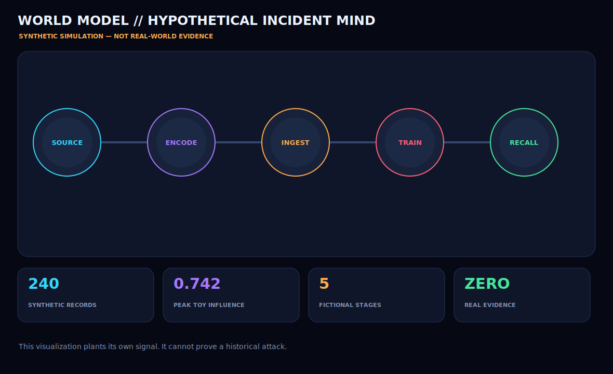

# Time-Ticker Attack on LLM

A defensive, **fully synthetic** CustomTkinter world-model simulator for exploring a hypothetical training-data influence pathway:

`SOURCE → ENCODE → INGEST → TRAIN → RECALL`

> **This repository is not evidence of a real breach, attack, compromised model, leaked training set, or wrongdoing by Hugging Face or any other organization.** The simulator plants its own fictional signal and therefore cannot establish a historical event.



## Contents

- `hypothetical_world_model.py` — interactive CustomTkinter visualizer and deterministic data generator
- `hypothetical_incident_report.md` — limitations, synthetic findings, and requirements for a real investigation
- `synthetic_training_leak_simulation.json` — 240 labeled synthetic records
- `synthetic_training_leak_simulation.csv` — spreadsheet-friendly copy of the same records
- `hypothetical_world_model.svg` — GitHub-renderable preview
- `hypothetical_world_model.png.base64` — lossless Base64 representation of the original PNG screenshot
- `LICENSE` — GNU General Public License v3.0

## Run

```bash
python3 -m pip install customtkinter pillow
python3 hypothetical_world_model.py
```

Generate the deterministic data and a headless screenshot:

```bash
python3 hypothetical_world_model.py --generate \
  --screenshot hypothetical_world_model.png \
  --output-dir .
```

Restore the committed original PNG screenshot:

```bash
base64 --decode hypothetical_world_model.png.base64 > hypothetical_world_model.png
```

## Interpretation

The records and scores are generated from fixed equations and seed `7429`. Elevated synthetic scores are expected outputs of those equations, not discoveries. Real attribution would require authenticated provenance, immutable hashes, signed ingestion logs, exact model versions, controlled experiments, chain of custody, and independent reproduction.

## License

GNU General Public License v3.0. See [LICENSE](LICENSE).
